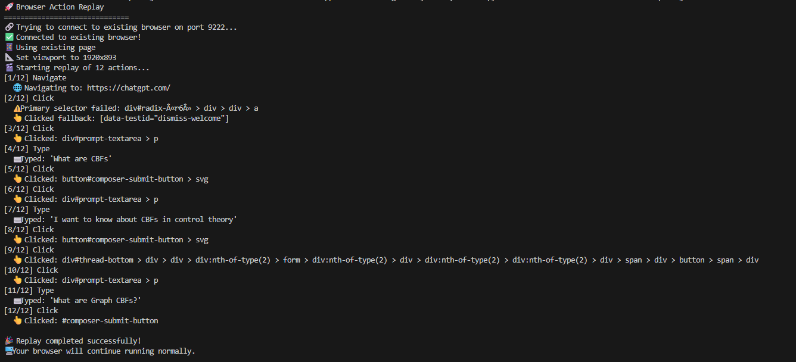

# Altera Chrome Extension Interview

Below are screenshots of the extension and action trace:

  
  

https://github.com/user-attachments/assets/0a936957-dec4-46c5-97e3-0e398cd8d469

## Problem

You will be implementing a version of the [Chrome DevTools Recorder](https://developer.chrome.com/docs/devtools/recorder). This is a tool that allows users to record and replay computer actions, such as clicking, typing, etc on Chrome.

Your final repo should contain the following 3 components:

1. A chrome extension that captures user actions on a Chrome browser and allows users to download action traces.
2. A script that takes in the recorded action trace and replays the same sequence of actions on a browser.
3. The recorded action trace of the following flow:
   1. Navigate to https://chatgpt.com
   2. Engage in a multiround conversation with ChatGPT. Use Search mode for at least one of the queries.

## Tips

The workflow we've asked you to record doesn't necessarily require computer actions beyond clicking and typing, but you are encouraged to implement more involved actions, such as scrolling, click and drag, etc. if you have time.

There are many possible implementations of this problem. The Chrome DevTools recorder uses HTML selectors. Another possible solution is the use of multimodal models or OCR for element detection. Think about the tradeoffs between robustness and generalizability. If you want to explain any part of your implementation, feel free to add a markdown to this repository.
